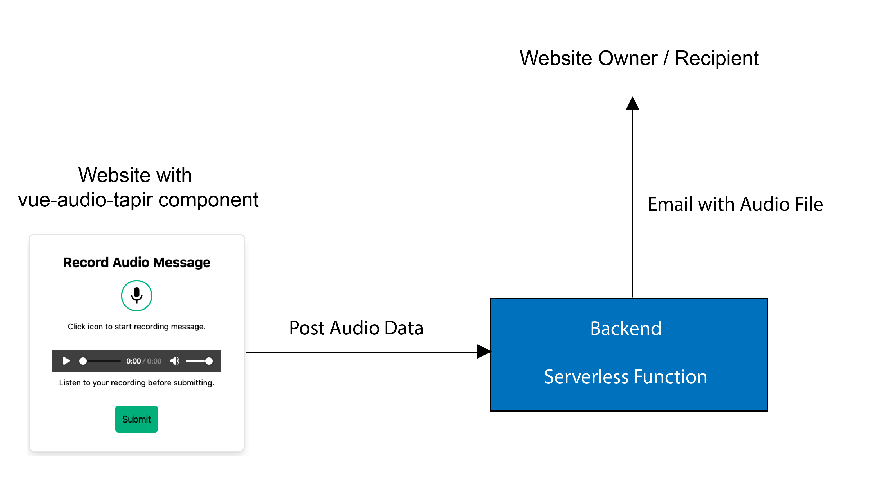

# audio-tapir-function

This is the backend serverless function for the corresponding
Vue 3 component [vue-audio-tapir](https://github.com/tderflinger/vue-audio-tapir).

It is a [Netlify function](https://functions.netlify.com/) and sends an email using the
Sendgrid service to a destination email address.
The email contains the recorded audio message as an
attachment.

Therefore, in order to use this function, you must
register at Netlify. They have a free service level
for serverless functions.

## Architecture Overview



The developer includes the [vue-audio-tapir](https://github.com/tderflinger/vue-audio-tapir) component in his Vue 3 website. 
When the user of the website wants to leave a voice message, he records his message and submits it. Vue-audio-tapir contacts the
backend server, this Netlify serverless function and uploads the audio data. The serverless backend function
sends the audio data to an email address using the email service Sendgrid.
Finally the email with the voice message arrives at the destination, probably the email application of the
website owner.

## Install

```bash
cd netlify/functions/audio-message
npm i
````

or
```bash
cd netlify/functions/audio-message
yarn
```

## Develop

You need to have the Netlify CLI
installed in order to run the function
on your local machine.

```bash
netlify dev
```

Run from base directory

## Deploy

```bash
netlify deploy --prod
```

## Environment Variables

The function uses the [Sendgrid](https://sendgrid.com/) service, therefore
you need to register there and obtain an API key.
They have a free service level.

The API key must be in the environment variable SENDGRID_API_KEY.

Other variables are EMAIL_TO, the email address of the destination
and EMAIL_FROM, the email address that appears as the sender.

When you deploy the function, these environment variables need to
be added manually in the Netlify function dashboard.

## License

MIT license

